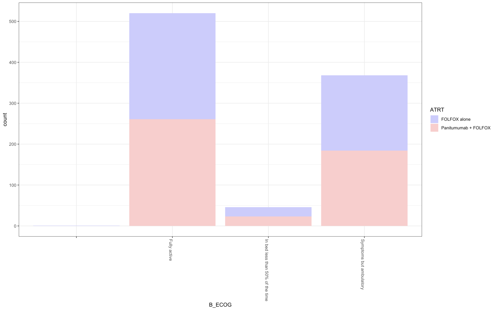
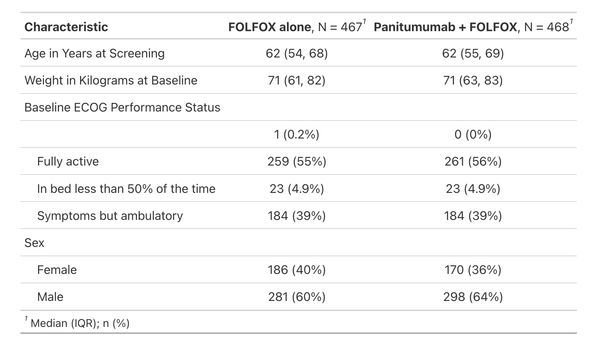
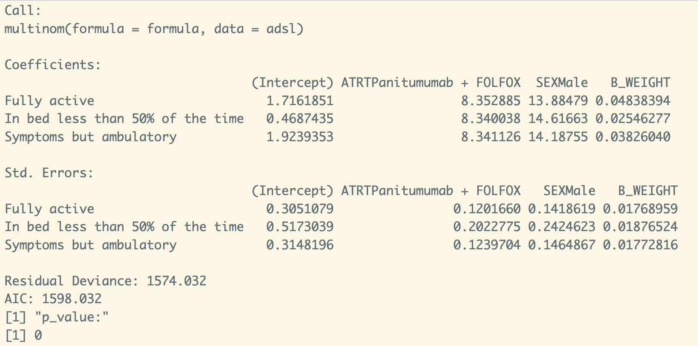

<!-- README.md is generated from README.Rmd. Please edit that file -->

# bis620_final

<!-- badges: start -->

[](https://github.com/XXuan-1/bis620_final/actions/workflows/R-CMD-check.yaml)
[](https://github.com/XXuan-1/bis620_final/actions/workflows/test-coverage.yaml)
<!-- badges: end -->

The package bis620.2023 is designed to offer an regression analysis based on a research question with more details in my_vig.Rmd under vignettes/.

## Installation

You can install the development version of bis620_final from
[GitHub](https://github.com/) with:

``` r
# install.packages("devtools")
devtools::install_github("XXuan-1/bis620_final")
```

## Example

Here are several snapshots of the displays under different selections.

``` r
library(bis620_final)
summary_ecog_trt(adsl)
```




``` r
summary_tbl(adsl)
```



``` r
analysis("SEX + B_ECOG + B_WEIGHT",adsl)
```




